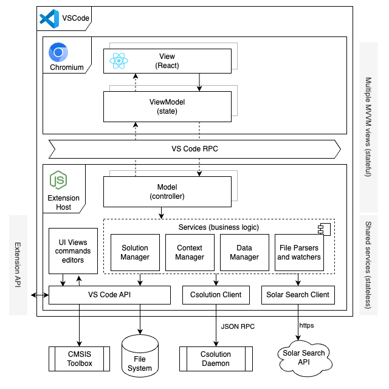

# CMSIS Solution Extension Architecture Documentation

> **Hint:** This documentation uses [Mermaid](https://mermaid.js.org/intro/syntax-reference.html) diagrams. For Visual Studio Code consider installing [Markdown Preview Mermaid Support](https://marketplace.visualstudio.com/items?itemName=bierner.markdown-mermaid).
> Manually crafted diagrams are created with [Draw.io](https://www.drawio.com/). For Visual Studio Code consider installing [Draw.io Integration](https://marketplace.visualstudio.com/items?itemName=hediet.vscode-drawio).

The overall architecture of a Visual Studio Code Extension is given in the following diagram:

A Visual Studio Code extension is split into two main parts: the extension host backend and the Chromium frontend. The extension host backend runs in a separate Node.js process and handles tasks such as file system access, language server communication, and other long-running operations. The Chromium frontend, which is part of the main VS Code window, is responsible for rendering the user interface and handling user interactions. This separation ensures that the UI remains responsive while the backend performs resource-intensive tasks.

Communication between the backend and frontend occurs via a JSON-RPC channel, which allows the frontend to send requests and receive responses. This channel only support structured data but no rich class objects to be transferred.

For testability reasons business logic shall be kept in the backend code as much as possible. Its easier to debug and unit test backend code than involving frontend code.

## Views

The extension contributes a couple of independent views to the Code UI.

### Solution Outline

The Solution Outline docks into the left panel presenting a tree view for the selected solution.

[TO BE DOCUMENTED](views/solution-outline)

### Create Solution

The Create Solution dialog shall present boards, devices, and draft projects to the user. The draft project shall be used to initialize a new solution workspace.

[TO BE DOCUMENTED](views/create-solution)

### Configure Solution

[TO BE DOCUMENTED](views/manage-layers)

### Context Selection

[TO BE DOCUMENTED](views/context-selection)

### Manage Components

[TO BE DOCUMENTED](views/manage-components-packs)

### Configuration Wizard

[TO BE DOCUMENTED](views/config-wizard)

## Business Logic

### Data Manager

The Data Manager abstracts access.

[Design Documentation](data-manager/DESIGN.md)

### Solar Search Client

[TO BE DOCUMENTED](solar-search)
