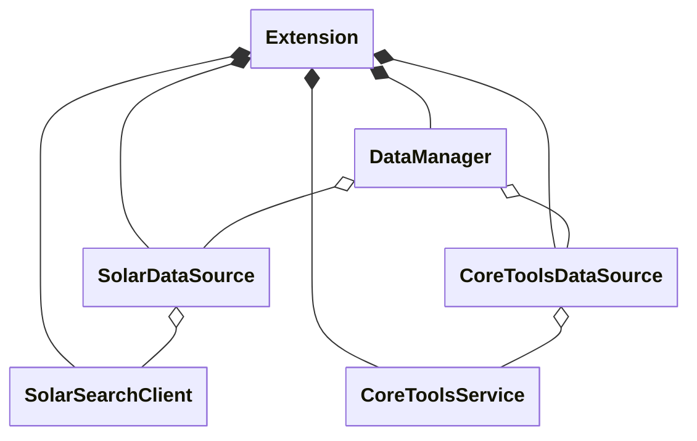
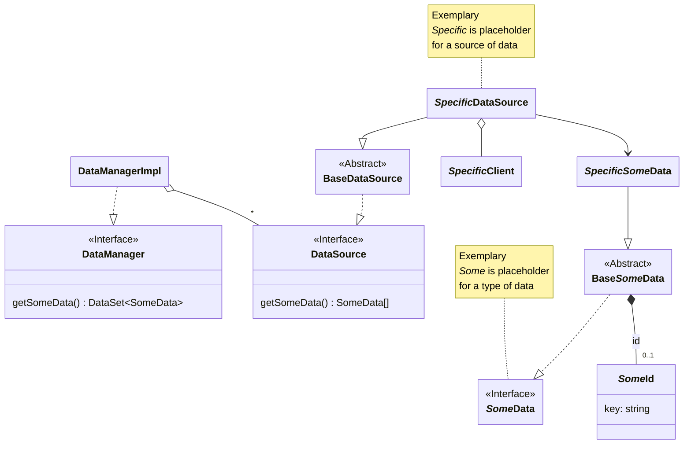
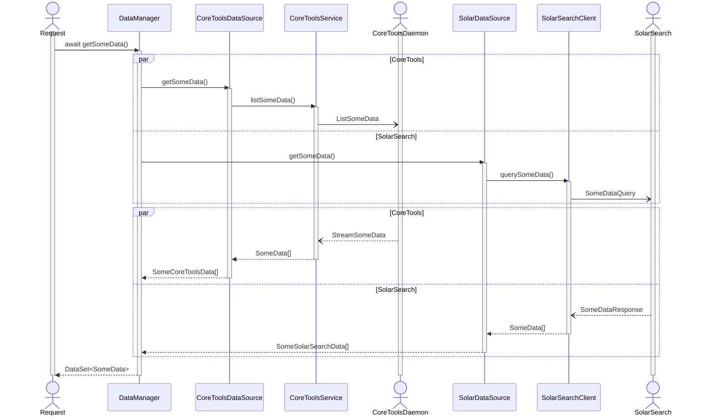

# Data Manager Design Documentation

> **Hint:** This documentation uses [Mermaid](https://mermaid.js.org/intro/syntax-reference.html) diagrams. For Visual Studio code consider installing [Markdown Preview Mermaid Support](https://marketplace.visualstudio.com/items?itemName=bierner.markdown-mermaid).

## Introduction

The Data Manager is responsible for fetching data from various sources, such as [Solar Search](https://solar-search.api.keil.arm.com/). The interface is agnostic to the actual source, i.e., the user shall not need to know about the source in order to use the retrieved information.

## Design

This section shall give an overview of the design decision made for Data Manager. In general, Data Manager provides a facade to various data sources and data elements. A consumer can query and use the data elements without being burdened with source details.



### Data sources and types

The following diagram gives an overview of interfaces and implementations.



For each specific source of data an implementation `SpecificDataSource` of interface `DataSource` is available which connects to the `SpecificClient`.

For each type of data an interface `SomeData` with an abstract base implementation `BaseSomeData` is available. The non-abstract implementations `SpecificSomeData` connect to the according specific data source.

Data elements may have a unique `id` with a `key` property. Collections of such elements can be aggregated into a hash set `DataSet<SomeData>` using that `key`.

### Default Implementation Idiom

The following idiom is used to expose only interfaces while the default implementations are kept internal:

```ts
// declaration
export interface DataManager {}
class DataManagerImpl DataManager {}
interface DataManagerConstructor {}
export const DataManager: DataManagerConstructor = DataManagerImpl;

// usage
const dataManager : DataManager = new DataManager();
```

## Implementation

The `DataManager` holds a list of data sources. For each data query the list is iterated, the query is forwarded to all data sources, and the results are aggregated.

Each data source is responsible for

- Query/fetch the data element(s)
- Encapsulate the data behind a facade implementing the `SomeData` interface

### Get data from multiple sources

Fetching `SomeData` from multiple source, such as Core Tools and Solar Search, is executed like the following:



All requests/queries to enabled data sources are kicked off in parallel. Once all responses are retrieved, the individual collections of data are joined into the final `DataSet<T>`.

### `SomeData` interface facades

A data element can be made up from primary and secondary data fields.Primary data fields can be used synchronously and hence their values must be provided at query time. Secondary data fields can be fetched asynchronously if required, i.e., by running another data source request.

```ts
interface SomeData {
  get primaryField(): string | number;
  get secondaryField(): Promise<string | number>;
}
```

The following diagram sketches handing of a secondary data field.

```mermaid
sequenceDiagram
  actor R as Request
  activate R

  participant Data as SpecificSomeData
  participant Source as SpecificDataSource
  participant Client as SpecificClient

  actor Server as SpecificServer
  activate Server

  R ->> Data: await secondaryField
  activate Data

  Data ->> Source: getSecondaryData()
  activate Source

  Source ->> Client: fetchSecondaryData()
  activate Client

  Client -) Server: SecondaryDataRequest
  Server --) Client: SecondaryDataResponse

  Client -->> Source: SecondaryData
  deactivate Client

  Source -->> Data: SecondaryData
  deactivate Source

  Data -->> R: SecondaryValue
  deactivate Data

  deactivate Server
  deactivate R
````
